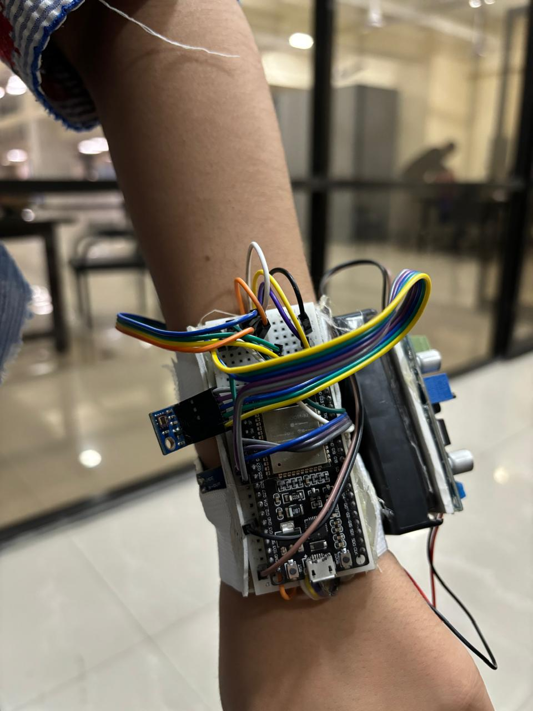

<h1  align="center" id="title">Patient Health Monitoring System</h1>

<p id="description">The Patient Health Monitoring System is a real-time solution designed to monitor vital signs like heart rate oxygen levels body temperature UV exposure and step count. The data is displayed on a dedicated website. Healthcare professionals can remotely monitor patients’ vitals making it a cost-effective and practical solution for remote health management.</p>

<p align="center">
  
  
  
</p>


<h2>🧐 Features</h2>

Here're some of the project's best features:

*   <strong>Heart Rate & SpO2:</strong> Measured using the MAX30105 sensor through light absorption.

*   <strong>Body Temperature:</strong> Indirectly measured by the MAX30105’s internal temperature sensor.

*   <strong>UV Exposure:</strong> Monitored using the GYML8511 UV sensor.

*   <strong>Step Count:</strong> Tracked via the ADXL335 accelerometer.


<h2> 🛠️ Required Components:</h2>

<p align="center">

| Components |
| ------------- |
| MAX30105 |
| GYML8511 |
| ADXL335 |
| ESP32 |
| Breadboard |
| Jumper Wires |
| Power Supply |
| Buck Converter |

</p>

<h2> 🚀 Methodology</h2>

The system consists of three main components:

1.  **Sensor Setup:** The MAX30105 sensor is used to measure heart rate and SpO2 levels, the ADXL335 accelerometer tracks step count, and the GYML8511 UV sensor monitors UV exposure. These sensors are connected to an ESP32 microcontroller.

2.  **Data Processing:** The sensor data is processed on the ESP32 and transmitted over WebSocket to a client.

3.  **Real-Time Alerts:** Abnormal readings trigger instant alerts on the web interface.

<h2> 📦 Hardware Setup</h2>

1.  **MAX30105:** The MAX30105 sensor is connected to the ESP32 using the I2C protocol. The sensor measures heart rate and SpO2 levels.

<p align="center">

|MAX30105 Pin| ESP32 Pin|
| ------------- | ------------- |
| VCC | 3.3V |
| GND | GND |
| SDA | G21 |
| SCL | G22 |
</p>

2.  **GYML8511:** The GYML8511 UV sensor is connected to the ESP32 using an analog pin. The sensor measures UV exposure.

<p align="center">

|GYML8511 Pin| ESP32 Pin|
| ------------- | ------------- |
| VCC | 3.3V |
| GND | GND |
| UVOUT | G33 |
| REF_3V3 | G36 |
|EN_PIN|25|
</p>

3.  **ADXL335:** The ADXL335 accelerometer is connected to the ESP32 using analog pins. The sensor tracks step count.

<p align="center">

|ADXL335 Pin| ESP32 Pin|
| ------------- | ------------- |
| VCC | 3.3V |
| GND | GND |
| X | G32 |
| Y | G35 |
| Z | G34 |
</p>

<h2> 🛠️ Software Setup</h2>
First, clone the repository using the following command:

```bash
git clone https://github.com/hasnat0006/MMA-PROJECT.git
```
Go to the project directory:

```bash
cd MMA-PROJECT/Frontend
```

Now, install the required dependencies:

```bash
npm install
```
Go to Arduino Code directory:

```bash
cd MMA-PROJECT/Arduino Code
```
To run the project, you need to install the following libraries:

* SparkFun MAX3010x Pulse and Proximity Sensor Library
* SparkFun ADXL345 Library
* Adafruit GY-ML8511 UV Sensor Library
* Arduino WebSockets

After installing the libraries, open the `MMA-PROJECT.ino` file in the Arduino IDE and upload it to the ESP32.

Before running the frontend, make sure the ESP32 is connected to the same network as the frontend. Then go to the frontend directory and open `WebSocketComponent.tsx` and change the IP address to the ESP32's IP address.
````tsx
const ws = new WebSocket('ws://your-esp32-ip-address:81');
````

Finally, run the frontend using the following command:

```bash
npm run dev
```
Now, open your browser and go to `http://localhost:3000` to view the dashboard.


